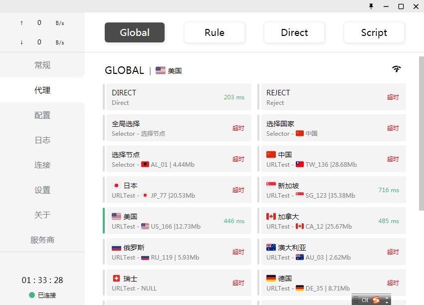
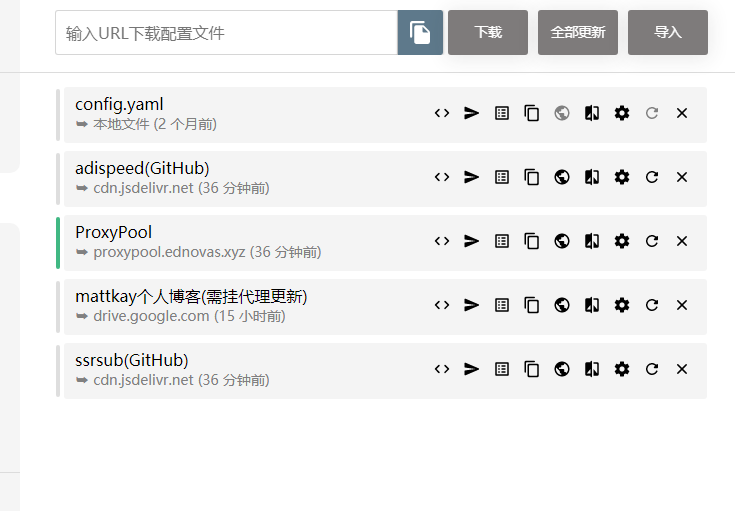

<!--
 * @Author: whalefall
 * @Date: 2021-06-05 07:26:21
 * @LastEditTime: 2021-06-06 11:06:26
 * @Description: GitHub 代理教程
-->
# How to get on the International Network
> **如何进入国际网络？**
---
## Part 1: Chinese Government Blockade International Network
> **中国政府封锁国际网络**
---
> 防火长城（英语：Great Firewall，常用简称：GFW，中文也称中国国家防火墙，中国大陆民众俗称墙、网络长城、功夫网等等），是对中华人民共和国政府对中国大陆境内的互联网所创建的审查系统（包括相关行政审查系统）的统称。随着使用的拓广，“墙”有时也被用作动词，中国网友所说的“被墙”即指网站内容被防火长城所屏蔽或者指服务器的通讯被封阻，“翻墙”也被引申为突破网络审查浏览中国大陆境外被屏蔽的网站或使用服务的行为。
---
## Part 2: How To Connection International Network in China?
> **在中国如何连接国际网络？**
### 1. 使用 `Clash` 代理软件

> ## 相关项目
> ### 1. [Clash 客户端](https://github.com/Fndroid/clash_for_windows_pkg/releases)
> ### 2. [Clash 汉化](https://github.com/BoyceLig/Clash_Chinese_Patch/releases)
> ### 3. [Clash Android 客户端](https://github.com/Kr328/ClashForAndroid/releases)
## Tips:
### **收集的各大免费节点订阅链接**
---
> https://cdn.jsdelivr.net/gh/adiwzx/freenode@main/adispeed.yml
> https://cdn.jsdelivr.net/gh/ssrsub/ssr/Clash.yml
### **免费节点发布个人blog**
---
> 1. [mattkaydiary](https://www.mattkaydiary.com/)
> 2. [proxypool](https://proxypool.ednovas.xyz/)
### 个人常用配置截图

```
https://cdn.jsdelivr.net/gh/adiwzx/freenode@main/adispeed.yml
https://proxypool.ednovas.xyz/clash/config
https://drive.google.com/uc?export=download&id=1Ky1MwwMOeswzDtu5MvOOlb-WYC9NFXz4
https://cdn.jsdelivr.net/gh/ssrsub/ssr/Clash.yml
```
### **本Repo国内加速下载地址**
> 总有一个可以用的.......
## 美国下载
> 1. https://gh.api.99988866.xyz/https://github.com/AdminWhaleFall/GFW/archive/refs/heads/master.zip
> 2. https://gh.msx.workers.dev/https://github.com/AdminWhaleFall/GFW/archive/refs/heads/master.zip
> 3. https://gh.xiu2.xyz/https://github.com/AdminWhaleFall/GFW/archive/refs/heads/master.zip
> 4. https://gh.argv.cc/https://github.com/AdminWhaleFall/GFW/archive/refs/heads/master.zip
> 5. https://git.yumenaka.net/https://github.com/AdminWhaleFall/GFW/archive/refs/heads/master.zip
## 日本东京
> 1. https://download.fastgit.org/AdminWhaleFall/GFW/archive/refs/heads/master.zip
## 韩国首尔
> 1. https://ghproxy.com/https://github.com/AdminWhaleFall/GFW/archive/refs/heads/master.zip
## 中国香港
> 1. https://pd.zwc365.com/seturl/https://github.com/AdminWhaleFall/GFW/archive/refs/heads/master.zip
